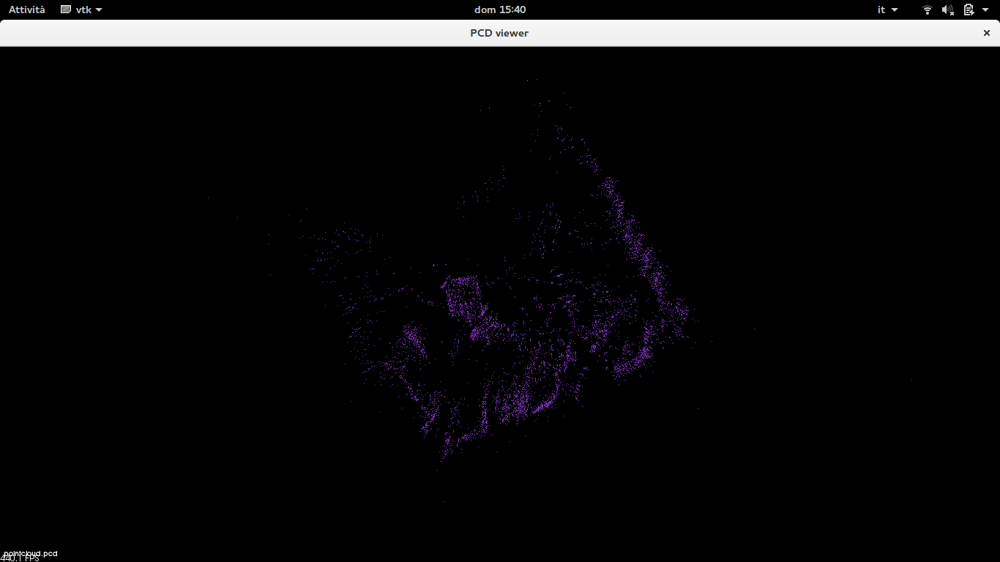

# Laboratorio ciberfisico UNIVR -  Homework 3
## Obbiettivo

Il terzo homework del corso di Laboratorio Ciberfisico (AA 2017/2018) presso l'università degli studi di Verona è diviso in quattro step. 
 - Prima parte:  Installazione di ORB_SLAM2
 - Seconda parte: Esecuzione di ORB_SLAM2 su una rosbag predefinita
 - Terza parte: Creazione di un file pcd coi punti trovati nella parte precedente
 - Quarta parte: Utilizzare la libreria per visualizzare il file .pcd e clusterizzare i punti della point cloud 

## Contenuto

ORB_SLAM2_edit contiene una versione modificata di ORB_SLAM2 in modo che possa eseguire il salvataggio della mappa. Il codice per il salvataggio della mappa è descritto nel seguente [link](https://medium.com/@j.zijlmans/orb-slam-2052515bd84c).

Va precisato che per il corretto funzionamento del codice vanno commentate due righe in quanto causavano un blocco nell'esecuzione del programma. Le righe sono le seguenti.

```
    //if(mpViewer)
        //pangolin::BindToContext("ORB-SLAM2: Map Viewer");
```

La cartella Cluster contiene la risoluzione del punto 4, che permette la clusterizzazione del file .pcd ottenuto dal punto tre. Il programma originale può essere ottenuto in questo [link](http://www.pointclouds.org/documentation/tutorials/cluster_extraction.php).

All'interno della repository sono presenti anche i risultati delle 4 parti della consegna.


## Compilazione & run

Per compilare basterà lanciare il programma build.sh.
Per quanto riguarda l'avvio, bisogna modificare run.sh con il proprio path verso il file .bag desiderato, per poi avviare lo script.

## Funzionamento 

Successivamente all'avvio di run.sh verrano attivati 3 programmi
 - Roscore
 - ORB_SLAM2
 - rosbag play del file .bag 

Quando tutti e 3 i programmi saranno avviati correttamente, per avviare il processo di cattura dei punti da parte di ORB_SLAM2 basterà spostarsi nel terminale relativo all'avvio del rosbag e premere invio.


Al termine della cattura dei punti, bisogna sportarsi sul terminale relativo a ORB_SLAM2 e premere CTRL+C, così da avviare il salvataggio del point cloud. 

Successivamente è possibile osservare il risultato ottenuto tramite 
```
 pcl_viewer pointcloud.pcd 
```

Una volta ottenuto il file .pcd bisogna spostarlo nella cartella Cluster/build/ ed eseguire il programma cluster_extraction associato alla distanza desisderata
```
 ./cluster_extraction pointcloud.pcd 0.26
```

L'esecuzione del programma creerà i file Cloud_point, visibili con la seguente riga di comando. 
```
pcl_viewer cloud_point_*
```
## Immagini
Screen del primo file pcd prodotto dal punto 3


di seguito diverse clusterizzazione a diversi valori.

0.20

0.26

0.28

0.40

